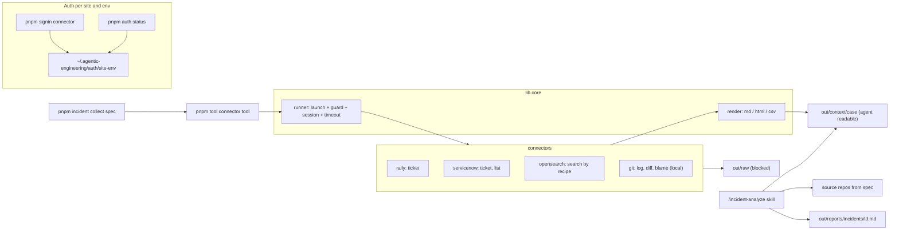

# Plan: connectors, tools and incident analysis

## Decisions taken
- **How tools are called:** through a CLI, `pnpm tool <connector> <tool> [--param=value]`. Skills and slash commands call that CLI, so the current sandbox and allowlist model stays as it is.
- **What the agent may read:** tools write markdown, HTML or CSV into `out/context/<case>/`, and the agent may read that folder. Two conditions must both hold: the env is marked `agentReadable: true`, and the spec names an approver. `out/raw`, `out/logs`, `out/traces` and `~/.agentic-engineering/` stay blocked.
- **Assumption, please confirm:** "git" means local clones listed in the incident spec. That needs no browser and no sign-in. A web connector for GitLab or Bitbucket can be added later in the same shape as the others.

## Target architecture



## Layout

```
connectors/<name>/connector.ts     config (the current TaskConfigInput: site, envs, session, guard) + list of tools
connectors/<name>/tools/<tool>.ts  defineTool({ params: zod, run(ctx) -> records, render: { md, html?, csv? } })
connectors/opensearch/recipes/*.ts saved searches: index, query template, fields, time field
specs/connectors/<name>.md         site, envs, auth, data approval (+ agentReadable)
specs/incidents/<id>.md            ticket ids, log recipes + time window, repos + paths
lib/runner.ts                      browser run core, extracted from automations/run.ts
lib/render/                        markdown / html / csv helpers
automations/tool.ts                pnpm tool
automations/auth.ts                pnpm auth status
automations/incident.ts            pnpm incident collect
.claude/skills/connector-build/    discovery skill (successor to web-crawl-script)
.claude/skills/incident-analyze/   analysis skill
```

Existing tasks stay working: `pnpm crawl <task>` remains, and each task becomes a connector with one `crawl` tool once the core is in place.

## Phases

### Phase 1: core refactor (no new site)
- Extract the browser run from [automations/run.ts](automations/run.ts) into `lib/runner.ts`: launch, `installGuard`, the 401 listener, `ensureSession`, the deadline, closing, and exit resolution. `run.ts` and the new `tool.ts` both call it.
- `defineTool` type in [lib/types.ts](lib/types.ts): a zod schema for params (replacing raw strings), a zod schema for the output record, `run(ctx)`, and per-format `render`. `--format=md|html|csv` picks the renderer.
- Add `agentReadable` to `EnvConfig`, defaulting to `false` in [lib/config.ts](lib/config.ts). Write to `out/context/<case>/` only when it is `true`. Otherwise write to `out/raw` only and print the path.
- Output naming: `out/context/<case>/<connector>-<tool>-<key>.<ext>`, with `--case=<id>` defaulting to the key. Files are written atomically through [lib/output.ts](lib/output.ts).
- Update [.claude/settings.json](.claude/settings.json): add `pnpm tool *`, `pnpm auth *` and `pnpm incident *` to `excludedCommands`. Keep the read deny on `out/raw`, `out/logs`, `out/traces` and the auth directory.
- Tests: extend [test/mock-app.ts](test/mock-app.ts) with a ticket endpoint, plus a mock connector with `ticket` and `list` tools. Cover the md and html render, the `agentReadable` gate, and the guard and session exits through the tool path.

### Phase 2: auth and session lifecycle
- `pnpm signin <connector> [--env]` works as today, with one profile per `site-env`.
- `pnpm auth status [connector]` opens each profile headless, loads `startUrl` and runs `ensureSession`, then prints a table of OK, expired or missing. It never prints data.
- On exit 2 (session expired), `pnpm tool` and `pnpm incident` print the exact `pnpm signin ...` command. In an interactive terminal, `--signin-on-expire` opens the sign-in window, then retries once after it closes. Company SSO cannot be refreshed without a person, so the goal is the fastest possible re-sign-in, not a silent refresh.
- `pnpm incident collect` runs `auth status` for every connector it needs first, and lists every expired one up front instead of failing halfway.

### Phase 3: ServiceNow connector
- Fill in [specs/servicenow-incident.md](specs/servicenow-incident.md) as `specs/connectors/servicenow.md`, answering its open questions: UAT instance, approver, and whether the REST Table API is allowed.
- Tools:
  - `ticket --number=INC...`: the incident, the caller or opener's profile with pNumber, comments and work notes, and attachments as metadata only.
  - `list --query=... --from --to [--limit]`: a list.
- Preferred reads are GETs: `/api/now/table/incident?sysparm_query=...` and `sys_journal_field` for notes, paged with `sysparm_offset`.
- Render: md by default, `--format=html` as an option, with a fixed template (header table, timeline of notes).

### Phase 4: Rally connector
- `ticket --id=US123|DE456|TA789`: the artifact, its fields, parent and children, tasks, defects, discussion posts, and revision history if needed. Rendered to markdown.
- Expected API: WSAPI `/slm/webservice/v2.0/...` with GET and browser cookies, to be confirmed by discovery. Set `maxPages` and `rate` to stay within Rally limits.

### Phase 5: OpenSearch connector
- **Discovery** with playwright-cli under the guard: identify OpenSearch Dashboards and its version, and the search endpoint. It is usually a POST such as `/internal/search/opensearch-with-long-numerals`, `/internal/search/opensearch` or `/api/console/proxy`. Also check whether the reporting plugin offers a CSV download.
- Because search is a POST, each search endpoint is added to `writeAllowlist` by exact URL and recorded in the spec with the approver's sign-off. Saving a search or a visualization stays blocked.
- **Recipes** (`connectors/opensearch/recipes/<name>.ts`): index pattern, time field, a query template with placeholders (`{keyword}`, `{service}`), field list and sort. They are created during discovery from what a person searches by hand, then stored so they can be repeated.
- Tool `search --recipe=<name> --keyword=... --from=... --to=... [--max=N]`: pages with `search_after` or point in time up to a cap, and writes CSV, plus a short md summary of counts per field and the first or last error lines. If the reporting plugin exists, a `--via=report` option downloads its CSV instead.

### Phase 6: local git connector
- Not a browser connector: it runs `git` read-only (`log`, `show`, `diff`, `blame`) on repos listed in the incident spec.
- Tools:
  - `changes --repo --from --to`: commits in the incident window, rendered as md.
  - `blame --repo --path --lines`.
- The agent can read source directly; this connector only gathers history around the incident time.

### Phase 7: incident spec, collect command and analysis skill
- `specs/incidents/_template.md`:
  - ticket references: ServiceNow INC and Rally ids;
  - log recipes with keyword and time window;
  - repos with path, branch or tag, and the folders or modules involved;
  - known symptoms;
  - the data approval section.
- `pnpm incident collect specs/incidents/<id>.md`: runs the auth check, then every tool listed, into `out/context/<id>/`, and writes `out/context/<id>/index.md` listing what was collected and what failed.
- Skill and slash command `/incident-analyze <spec>`:
  1. Read `index.md` and the context files.
  2. Build a timeline from tickets, logs and commits.
  3. Find error signatures in the logs, then map stack traces and log messages to code in the listed repos.
  4. Check the commits in the window.
  5. Write `out/reports/incidents/<id>.md` with a summary, timeline, root-cause hypotheses ranked with evidence and confidence, the code locations involved, and suggested next checks.
- Skill `/connector-build new <connector-spec>` replaces `web-crawl-script` for new connectors and tools. It reuses the same probe rules (guard on, approved env only, no credentials).

## Open questions to answer per phase
- URLs, SSO and MFA for Rally, ServiceNow and OpenSearch; which env the agent may probe; who approves each.
- ServiceNow: may the Table API be used? Where does the pNumber come from (see the spec's open questions)?
- OpenSearch: Dashboards version, and whether the reporting plugin is installed. Which search POSTs may go into the allowlist?
- Git: confirm local clones only, or also a web host.
- PII: is the `agentReadable` gate enough, or should masking of pNumber, email and names be added later?